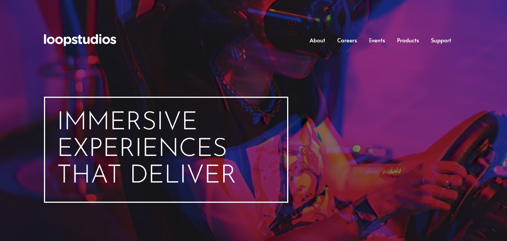

# Frontend Mentor - Loopstudios landing page solution

This is a solution to the [Loopstudios landing page challenge on Frontend Mentor](https://www.frontendmentor.io/challenges/loopstudios-landing-page-N88J5Onjw). Frontend Mentor challenges help you improve your coding skills by building realistic projects.

## Table of contents

- [Overview](#overview)
  - [The challenge](#the-challenge)
  - [Screenshot](#screenshot)
  - [Links](#links)
- [My process](#my-process)
  - [Built with](#built-with)
  - [Useful resources](#useful-resources)
- [Author](#author)

## Overview

### The challenge

Users should be able to:

- View the optimal layout for the site depending on their device's screen size
- See hover states for all interactive elements on the page

### Screenshot

### Links

- Solution URL: [Loopstudios on FM](https://www.frontendmentor.io/solutions/loopstudios-landing-page-built-with-html-and-css-4JXv1HoW2W)
- Live Site URL: [Loopstudios landing page](https://dinadess.github.io/loopstudios-fm/)

## My process

### Built with

- Semantic HTML5 markup
- CSS custom properties
- Flexbox
- CSS Grid
- Mobile-first workflow

### Useful resources

- [MDN Responsive images](https://developer.mozilla.org/en-US/docs/Learn/HTML/Multimedia_and_embedding/Responsive_images) - An article on MDN for creating responsive and adaptative images with HTML picture tag.
- [Accessible CSS-only Hamburger Menu](https://unused-css.com/blog/css-only-hamburger-menu/) - A good resource for creating an accessible hamburger menu with CSS.

## Author

- Frontend Mentor - [@dinadess](https://www.frontendmentor.io/profile/dinadess)
